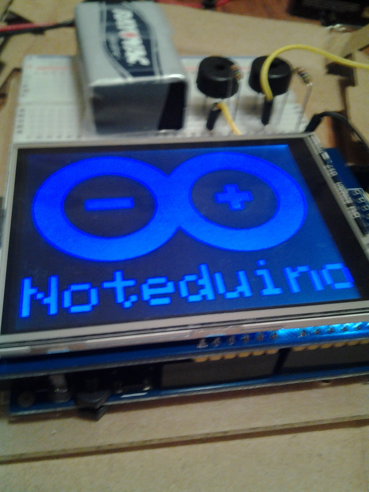
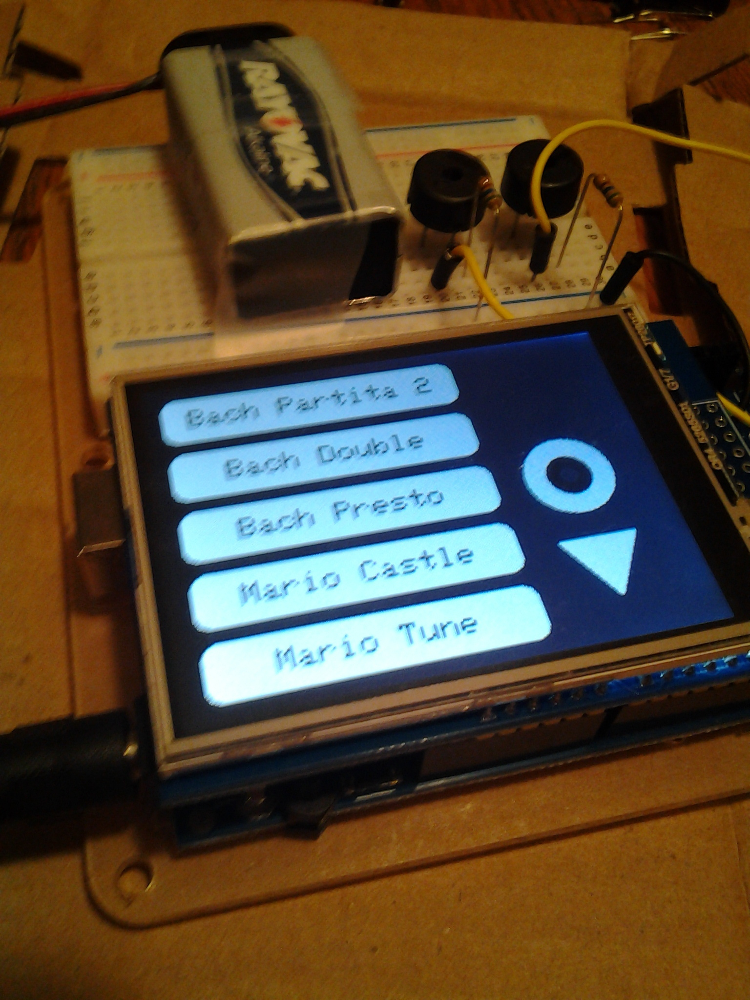
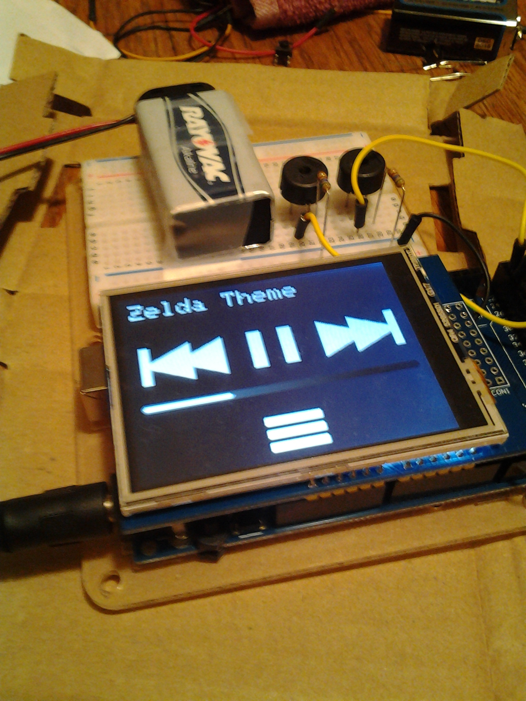

# MusicPlayer

This is an arduino program which makes use of the rogue-code Tone Library to control two buzzers simultaneously. It aims to simplify the task of programming multipart songs by providing a simple interface for declaring the note frequencies and durations for each part. To accomodate the large data structures needed to hold information about each song, the pgmspace.h library is used to store the songs in flash memory. It also features an LCD user interface complete with a splash screen, song selection list, and playback controls.

